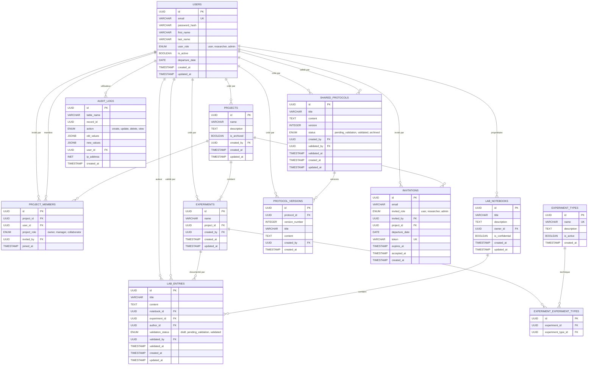

# Modèle Conceptuel de Données (MCD) - Lab Manager

Ce document présente le Modèle Conceptuel de Données du système Lab Manager sous forme de diagramme Mermaid.

## Diagramme MCD

## Description des Entités

### Entités Principales

#### USERS (Utilisateurs)
- **Rôle** : Gestion des utilisateurs du système
- **Attributs clés** : email unique, rôle (user/researcher/admin), statut actif
- **Relations** : Créateur de projets, membre d'équipes, auteur d'entrées

#### PROJECTS (Projets)
- **Rôle** : Organisation des travaux de recherche
- **Attributs clés** : nom, description, statut archivé
- **Relations** : Contient des expériences, a des membres avec rôles

#### EXPERIMENTS (Expériences)
- **Rôle** : Représentation des expériences scientifiques
- **Attributs clés** : nom unique par projet
- **Relations** : Appartient à un projet, utilise des techniques, documenté par des entrées

#### LAB_ENTRIES (Entrées de laboratoire)
- **Rôle** : Documentation des résultats expérimentaux
- **Attributs clés** : titre, contenu, statut de validation
- **Relations** : Appartient à un carnet, documente une expérience

### Entités de Support

#### PROJECT_MEMBERS (Membres de projet)
- **Rôle** : Association utilisateurs-projets avec rôles
- **Rôles disponibles** : owner, manager, collaborator

#### EXPERIMENT_TYPES (Types d'expérience)
- **Rôle** : Catalogue des techniques expérimentales
- **Exemples** : Culture cellulaire, QRTPCR, Western blot

#### SHARED_PROTOCOLS (Protocoles partagés)
- **Rôle** : Procédures standardisées réutilisables
- **Workflow** : Création → Validation → Publication

#### INVITATIONS (Invitations)
- **Rôle** : Gestion des invitations d'utilisateurs
- **Sécurité** : Token unique avec expiration

#### AUDIT_LOGS (Journal d'audit)
- **Rôle** : Traçabilité des actions utilisateurs
- **Actions** : create, update, delete, view

## Contraintes et Règles Métier

### Contraintes d'Intégrité
- Chaque projet doit avoir au moins un propriétaire (owner)
- Les expériences doivent avoir au moins un type
- Les dates de départ doivent être dans le futur
- Les noms d'expériences sont uniques par projet

### Contraintes de Sécurité
- Accès aux données basé sur l'appartenance aux projets
- Validation des protocoles partagés obligatoire
- Journalisation de toutes les actions sensibles

### Performances
- Index sur les colonnes de recherche fréquentes
- Partitioning potentiel pour audit_logs
- Contraintes de clés étrangères optimisées